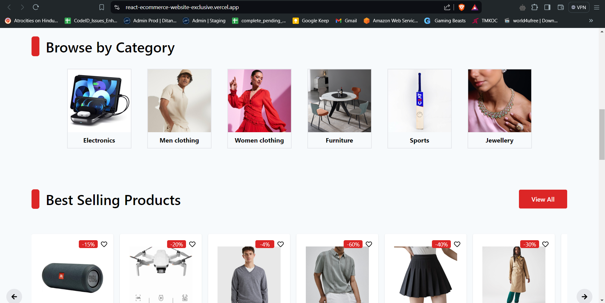

# E-Commerce Website

A full-featured e-commerce website with user authentication, product management, and Firebase and Strip Payment integration.
Hosted Link : https://react-ecommerce-website-exclusive.vercel.app/

## Features

- User Authentication
  - Login
  - Sign Up
- Product Management
  - Product Listing
  - Product Search
  - Product Filtering
  - Best Selling Products
  - Sale Products
- Shopping Features
  - Wishlist
  - Shopping Cart
- Payment Integration
- Firebase Database Integration
  - Cart Synchronization
  - Wishlist Synchronization

## Technologies Used

- [React, Context Api, React icons, Firebase, Strip,Vercel]
- Firebase (for database and authentication)
- Vercel (for deployment)

## Screen Shots

### Home Page

### Category

### Product Page

### Sign In

### Wishlist

### Shopping Cart

## Getting Started

### Installation

1. Clone the repository  
   git clone https://github.com/AyushiBadika/React-Ecommerce-website-Amazkart
2. Navigate to the project directory  
   cd ecommerce-website
3. Install dependencies  
   npm install
4. Start the development server  
   npm run dev

## Firebase Integration

This project uses Firebase for:

- User authentication
- Storing and syncing cart data
- Storing and syncing wishlist data

## Payment Integration

- User can make payments
